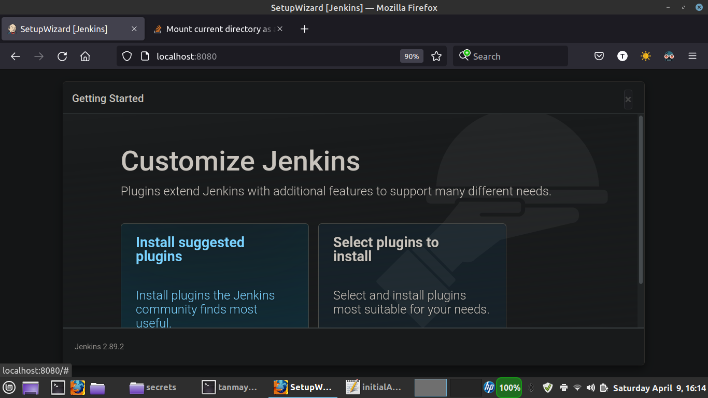

# Build C++ Application using Jenkins

This is a sample project of Calclator App written in C++ to demonstrate how we can build a C++ application using Jenkins.

## Running the Code
Since the version of C++ libraries differ from OS version to Version, I have created a docker container with the required library versions, tomcat7 and Java Runtime Environment (JRE 8)

## Steps:

* Build the docker container using the below command.
`sudo docker build -t tomcatdemo:1 .`

* Run the container
Here we will mount the jenkins folder into the container so that the jobs we create are persisted on the local filesystem.

`sudo docker run -p8080:8080 -v $PWD/jenkins:/jenkins tomcatdemo:1 `

## Execution

* Open the browser and go to 
http://localhost:8080

* On the first run, you will see the "Getting Ready" screen.

* On the first run, Jenkins creates a password which is logged in the secrets folder.

* Since we have mounted the jenkins folder inside the container, the secrets folder can be accessed from your filesystem. Go to jenkins/secrets folder and take the password from initalAdminPassword file.

* Next you will be asked to install any plugins of your choice

* Next you will be aske to setup admin user

* Finally the Jenkins is ready to use.

* The below is Homepage

* Create your Job to compile the C++ Application

* Add make all as build step.

* Run the Job.

* You can see the demo video of Job in action

